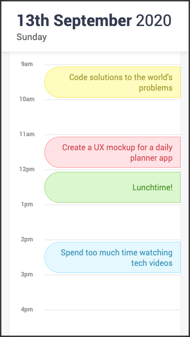
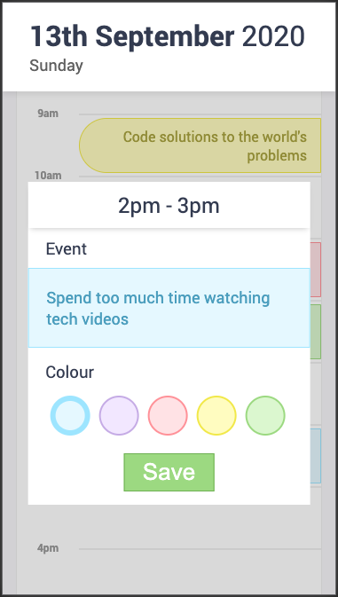

# DayPlanner

This is a simple calendar app to plan the workday. It is built with jQuery and Moment.js

Features include:

1. Day view of the current day
1. Visual indicator of current hour of the day (when during the 9-5 workday shown)
1. Ability to tap/click an hour block to add or edit an event
1. Option to choose the colour of the event
1. All tasks are saved to localStorage and will persist after page reload

## Link

https://rjwrightme.github.io/DayPlanner/

## Screenshots

The following images demonstrate the application functionality:

